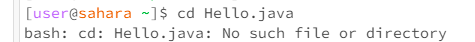
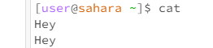
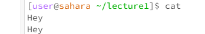

# Lab Report CSE 15L
Here  are the commands `cd`, `ls`, and `cat`, used with no argument, argument with path to  folder, and argument with path to file.

1) `cd` with no argument (main terminal):
Entering `cd` with no argument cause the working directory to shift to the main terminal. Because it was already in main terminal, it stays there.

`cd` with no argument (lecture1 terminal):
Causes the working directory to shift to the main terminal.

2) `cd` with argument as  path to folder(main terminal):
Causes working directory to change to the folder specified (lecture1, in this case). This change can be seen in prompt.

`cd` with argument as path to folder (lecture1 terminal):
Causes an error because trying to change to lecture1 terminal within the terminal itself. Does not recognize lecture1 subfolder within the lecture1 folder.

3) `cd` with argument as path to file (main terminal):
Causes an error because the file is not a directory that can be changed to.

`cd` with argument as path to file (lecture1 terminal):
Causes an error because the file is not a directory that can be changed to.

4) `ls` with no argument (main terminal):
`ls` with no argument in the main terminal gives the names of the folders in the main terminal. In this case, the only folder in the main terminal is lecture1.

`ls` with no argument (lecture1 terminal):
Gives the names of the files within lecture1 folder. Because there is no argument, the computer assumes that you want to view the files/folders within the working terminal (which is the lecture1 terminal in this case).

5) `ls` with argument as path to folder (main terminal):
Gives the names of the files within lecture1 folder. By writing in lecture1 as the argument, you tell the computer that you want to see the files/folders within lecture1.

`ls` with argument as path to folder (lecture1 terminal):
Produces an error message because there is no lecture1 subfolder or file within the lecture1 folder.

6) `ls` with argument as path to file (main temrinal):
Produces an error message because the `ls` command can only access one "layer" of the terminal. That is, from the main terminal, it can only access lecture1 folder, and other folders of the same level, but cannot look into the lecture1 folder (i.e., it cannot access the files within lecture1, such as Hello.java).

`ls` with argument as path to file (lecture1 terminal):
Gives Hello.java because `ls` command used on a file confirms the file's existence. `ls` command cannot give the files/folders within a file because nothing else can be stored within a file (only folders can store more subfolders and files).

7) `cat` with no argument (main terminal):
Running this command with no argument allows the user to input text into the terminal. Whatever text is inputted, is repeated in the next line. In this case, "Hey" was entered and repeated on the next line.

`cat` with no argument (lecture1 terminal):
Causes the same result as with the main terminal. Repeats the user's input.

8) `cat` with argument as path to folder (main terminal):
Running this command with the argument as path to a folder just confirms whether that file exists in the immediate working directory, which it does, in this case.

`cat` with argument as path to folder (lecture1 terminal):
This command returns that lecture1 is not an existing object eithin the lecture1 folder. This makes sens because this command is called from eithin the lecture1 terminal, so it only looks within lecture1, not outside.

9) `cat` with argument as path to file (main terminal):

