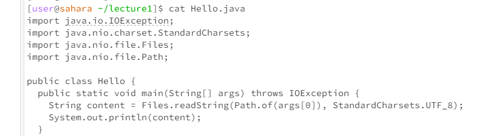

# Lab Report CSE 15L
Here are the commands `cd`, `ls`, and `cat`, used with no argument, argument with path to folder, and argument with path to file. The results are shown when the command is done in both the home directory and the lecture1 directory.

1) ___`cd` with no argument (from home directory):___
Entering `cd` with no argument cause the working directory to shift to the home directory. Because it was already in home directory, it stays there.

___`cd` with no argument (from lecture1 directory):___
Causes the working directory to shift to the home directory.

2) ___`cd` with argument as path to folder (from home directory):___
Causes working directory to change to the folder specified (lecture1, in this case). This change can be seen in prompt.

___`cd` with argument as path to folder (from lecture1 directory):___
Causes an error because trying to change to lecture1 terminal within the terminal itself. Does not recognize lecture1 subfolder within the lecture1 folder.

3) ___`cd` with argument as path to file (from home directory):___
Causes an error because the file is not a directory that can be changed to.

___`cd` with argument as path to file (from lecture1 directory):___
Causes an error because the file is not a directory that can be changed to.

4) ___`ls` with no argument (from home directory):___
`ls`, in general, gives the names of the files and folders of the terminal that this command is called in. `ls` with no argument in the home directory gives the names of the folders in the home directory. In this case, the only folder in the home directory is lecture1.

___`ls` with no argument (from lecture1 directory):___
Gives the names of the files within lecture1 folder. Because there is no argument, the computer assumes that you want to view the files/folders within the working terminal (which is the lecture1 terminal in this case).

5) ___`ls` with argument as path to folder (from home directory):___
Gives the names of the files within lecture1 folder. By writing in lecture1 as the argument, you tell the computer that you want to see the files/folders within lecture1.

___`ls` with argument as path to folder (from lecture1 directory):___
Produces an error message because there is no lecture1 subfolder or file within the lecture1 folder.

6) ___`ls` with argument as path to file (from home directory):___
Produces an error message because the `ls` command can only access one "layer" of the terminal. That is, from the home directory, it can only access lecture1 folder, and other folders of the same level, but cannot look into the lecture1 folder (i.e., it cannot access the files within lecture1, such as Hello.java).

___`ls` with argument as path to file (from lecture1 directory):___
Gives Hello.java because `ls` command used on a file confirms the file's existence. `ls` command cannot give the files/folders within a file because nothing else can be stored within a file (only folders can store more subfolders and files).

7) ___`cat` with no argument (from home directory):___
Running this command with no argument allows the user to input text into the terminal. Whatever text is inputted, is repeated in the next line. In this case, "Hey" was entered and repeated on the next line.

___`cat` with no argument (from lecture1 directory):___
Causes the same result as with the home directory. Repeats the user's input.

8) ___`cat` with argument as path to folder (from home directory):___
Produces an error message, because the command `cat` must be used with the name of a file, not a folder. So the error message states that the folder lecture1 does exist, but wants a file name.

___`cat` with argument as path to folder (from lecture1 directory):___
Produces an error message, because `cat` must be used with the name of a file. The error message also states that the folder does not exist. This makes sense because this command is called from within the lecture1 terminal, so it only looks within lecture1, not outside.

9) ___`cat` with argument as path to file (from home directory):___
Produces an error message. `cat` does not recognize the Hello.java file within the home directory. In the home directory itself, there is no Hello.java file, although there is the lecture1 folder, which contains this file, and because the cat command can only penetrate through 1 "layer", the computer believes that the Hello.java file does not exist.

___`cat` with argument as path to file (from lecture1 directory):___
Gives the contents and code of the Hello.java file.

