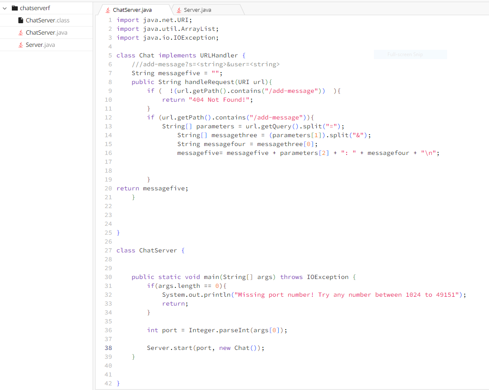
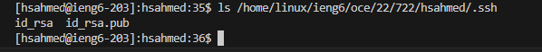

# Lab report 2 for CSE 15L

Part 1:

## Code:

import java.net.URI;
import java.util.ArrayList;
import java.io.IOException;

class Chat implements URLHandler {
    ///add-message?s=<string>&user=<string>
    String messagefive = "";
    public String handleRequest(URI url){
        if (  !(url.getPath().contains("/add-message"))  ){
            return "404 Not Found!";
        }
        if (url.getPath().contains("/add-message")){
            String[] parameters = url.getQuery().split("=");
                String[] messagethree = (parameters[1]).split("&");
                String messagefour = messagethree[0];
                messagefive= messagefive + parameters[2] + ": " + messagefour + "\n";
            

        }
return messagefive;
    }

}

class ChatServer {

    public static void main(String[] args) throws IOException {
        if(args.length == 0){
            System.out.println("Missing port number! Try any number between 1024 to 49151");
            return;
        }

        int port = Integer.parseInt(args[0]);

        Server.start(port, new Chat());
    }

}

Part 2:

Screenshots of public and private ssh keys:

Part 3:

I learned how to make login into the cse remote account easier. I also learned a lot about the scp and mkdir commands. Learning about Visual Studio code was also good, although I technically have already encountered this code editor in other classes. This was a good learning experince, and I hope to learn more soon.

