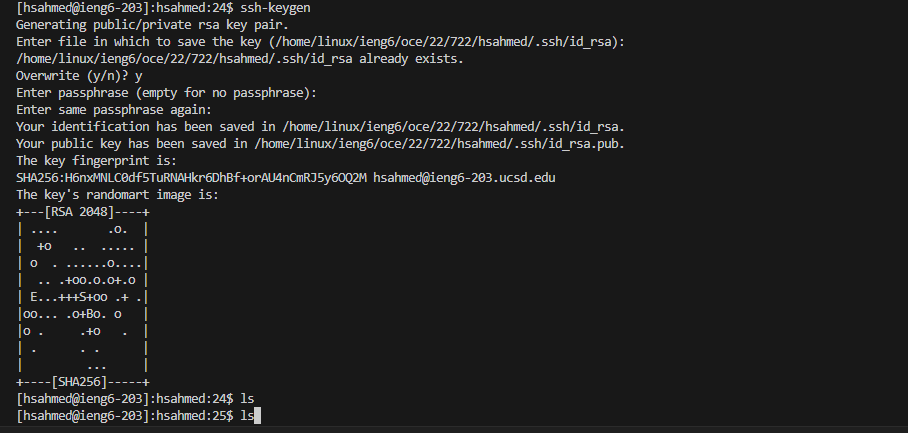

# Lab report 2 for CSE 15L

Part 1:

Part 2:

Screenshots of public and private ssh keys:

Part 3:

I learned how to make login into the cse remote account easier. I also learned a lot about the scp and mkdir commands. Learning about Visual Studio code was also good, although I technically have already encountered this code editor in other classes. This was a good learning experince, and I hope to learn more soon.

