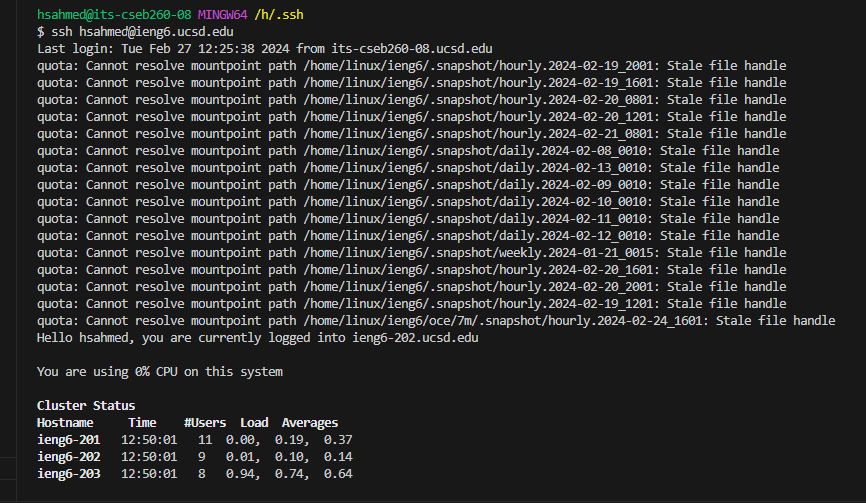
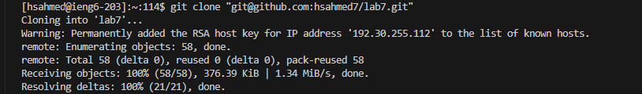
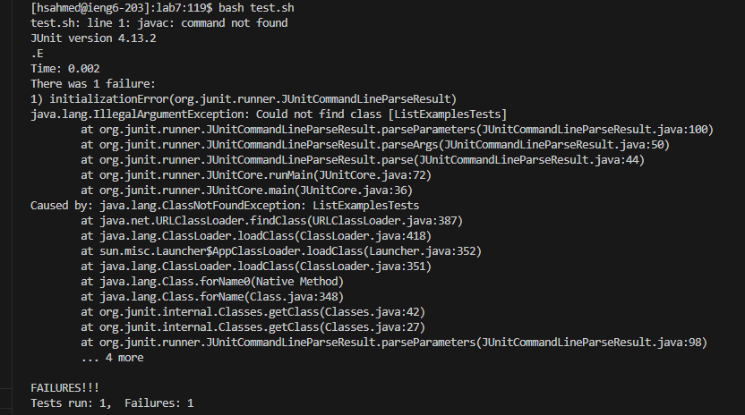
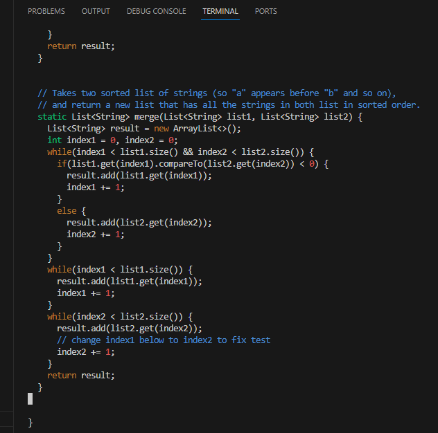
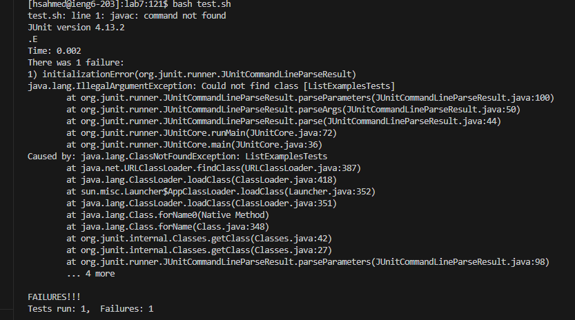
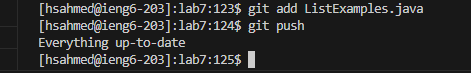

# Lab Report 4 for CSE 15L
1) Step 4: Log into ieng6 account:
   

Comments: The keys pressed were `ssh hsahmed@ieng6.ucsd.edu` and then `<enter>`. This caused the computer to open the ieng6 account.

2) Step 5: Git clone the fork of the repository:
   

   Comments: The keys pressed were ` git clone <ctrl> + v + <enter>`. The `<ctrl> + v` pasted the text `git@github.com:hsahmed7/lab7.git`. This caused the computer to git clone the fork of the repository.

3) Step 6: Run the tests:
   

   Comments: The keys pressed were first `cd lab7 + <enter>`, and then `bash test.sh + <enter>`. This caused the computer to run the JUnit tests, but it seems like there must be something wrong with the way that I entered the command, the working directory, or some other issue, because the actual output is different than expected. The JUnit test encountered a compilation error.

4) Step 7: Edit the ListExamples.java file in the vim editor, in order to pass the tests:
   

   Comments: The keys pressed were first `vim ListExamples.java`, and then ` [j] + [j] + [j] + [j] + x + i + [2] + <esc> + :wq `. This caused the computer to change `index1 += 1;` to `index2 += 1;`. The four `j`'s brought the cursor down to the area that needed to be edited, and then the `x` deleted the `1` in `index1`. The `i` entered the computer into insert mode, and the button for `2` was pressed to change `index1` into `index2`. The `<esc>` button was pressed in order to go back to Normal Mode. The `:wq` was pressed to save changes and close the vim editor.

5) Step 8: Run the test to demonstrate that it will succeed:
   
   

   Comments: The keys pressed were `bash test.sh + <enter>`. This caused the computer to run the JUnit tests, but there is a compilation error.

6) Step 9: Commit and push the changes:
   
   

   Comments: The keys pressed were `git add ListExamples.java`, and then `git push`. This caused the computer to add the updated version of the ListExamples.java file.
