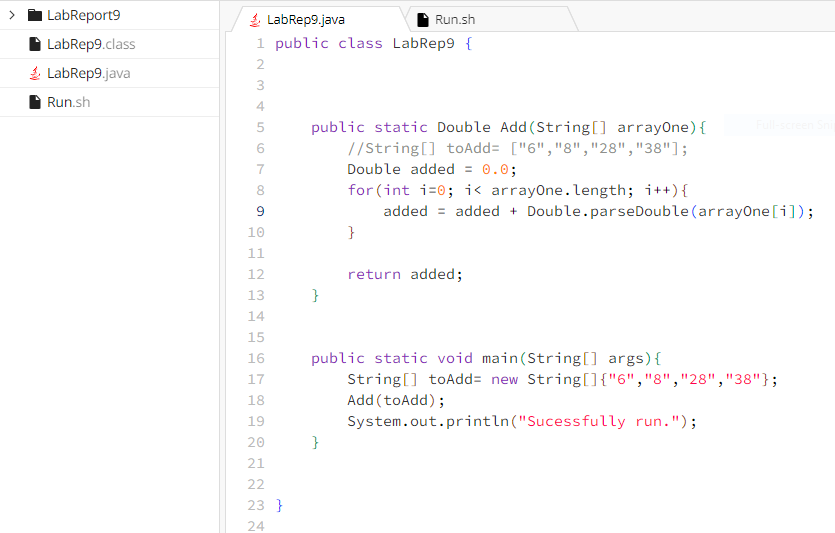

# Lab Report 5, CSE 15L

**Student post asking for help with getting rid of bug in code:**

Hello, 

I am having issues implementing the function Add. This method is supposed to take the String elements in an array (which all contain numeric text),
and add the numbers in the array together,and then return the result. However, there is a compile error. The error message says that I cannot convert 
an int into a string. But this does not make sense because I am trying to convert a string into a double, not an int type into a string. My best 
guess is either that Double.parseDouble is the wrong method to use here, or that I am doing the conditions for the for-loop wrong. What do you think?

(I have attached screenshots of the symptom and code below.)

**Response from TA:**

Hello, 

The Double.parseDouble is correct to use in this case. However, think about what you want to pass into this method as the argument. Do you want 
to pass in the index i of the iteration, or do you want to pass in the value of the array at that index i? And then think about which you are passing 
in. The "cannot convert from int to String" compile error most probably arises because the method is expecting a String argument, and you are passing 
in an int (the index i), and so the computer probably thinks you are somehow trying to convert the int type into a String. Hope that helps.

**Reply of Student: **

Thank you. I realized that I passed in an invalid argument into the Double.parseDouble method. I fixed the bug, and here are screenshots of my successfully completed code. Thank you for your help.

